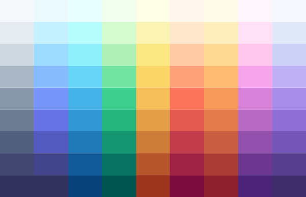

.. title:: css filter

.. meta::
    :description:
        Описание css стиля filter.
    :keywords:
        css filter

filter
======

Применяет различные фильтры к изображению

.. code-block:: css

    .colorize-pink {
        filter: brightness(0.5) sepia(1) hue-rotate(-70deg) saturate(5);
    }

    .colorize-navy {
        filter: brightness(0.2) sepia(1) hue-rotate(180deg) saturate(5);
    }

    .colorize-blue {
        filter: brightness(0.5) sepia(1) hue-rotate(140deg) saturate(6);
    }

blur()
------

Рамзытие

.. code-block:: css

    filter: blur(length);

.. code-block:: css

    img {
        filter: blur(5px);
    }

.. raw:: html

    

brightness()
------------

Яркость

.. code-block:: css

    filter: brightness([ number | percentage ]);

.. code-block:: css

    img {
        filter: brightness(3);
        filter: brightness(0.5);
        filter: brightness(20%);
    }

.. raw:: html

    

contrast()
----------

Контраст

.. code-block:: css

    filter: contrast([ number | percentage ]);

.. code-block:: css

    img {
        filter: contrast(1.5);
    }

.. raw:: html

    

drop-shadow()
-------------

Тень

.. code-block:: css

    filter: drop-shadow(length{2,3} color?)

.. code-block:: css

    img {
        filter: drop-shadow(5px 5px 5px #333);
    }

.. raw:: html

    

grayscale()
-----------

Оттенки серого

.. code-block:: css

    filter: grayscale([ number | percentage ]);

.. code-block:: css

    img {
        filter: grayscale(70%);
        filter: grayscale(0.7);
    }

.. raw:: html

    

hue-rotate()
------------

Угол на цветовом круге

.. code-block:: css

    filter: grayscale(angle);

.. code-block:: css

    img {
        filter: hue-rotate(200deg);
    }

.. raw:: html

    

invert()
--------

Инверсия

.. code-block:: css

    filter: invert([ number | percentage ]);

.. code-block:: css

    img {
        filter: invert(70%);
        filter: invert(0.7);
    }

.. raw:: html

    

opacity()
---------

Прозрачность

.. code-block:: css

    filter: opacity([ number | percentage ]);

.. code-block:: css

    img {
        filter: opacity(70%);
        filter: opacity(0.7);
    }

.. raw:: html

    

saturate()
----------

Насыщенность

.. code-block:: css

    filter: saturate([ number | percentage ])

.. code-block:: css

    img {
        filter: saturate(3);
        filter: saturate(200%);
    }

.. raw:: html

    

sepia()
-------

Сепия

.. code-block:: css

    filter: sepia([ number | percentage ])

.. code-block:: css

    img {
        filter: sepia(70%);
        filter: sepia(0.7);
    }

.. raw:: html

    

url()
-----

.. code-block:: css

    #svg-filter {
        display: none;
    }
    img {
        filter: url(#svg-blur);
    }
